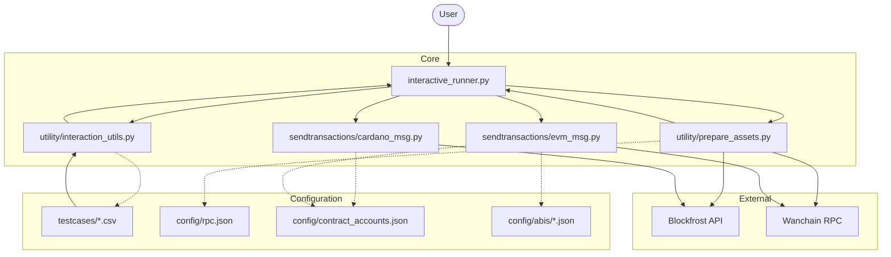
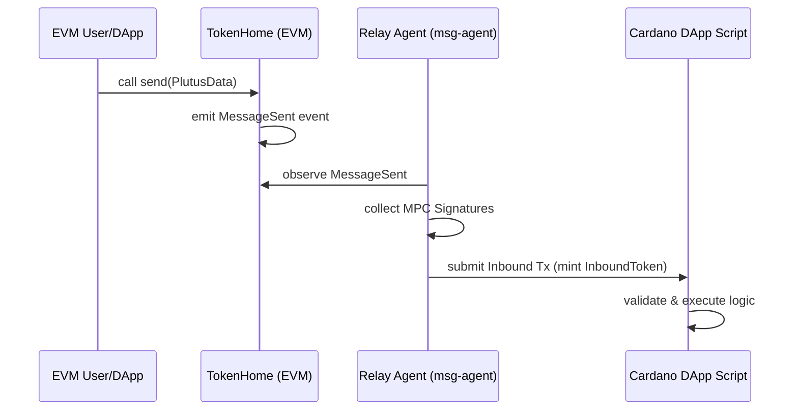
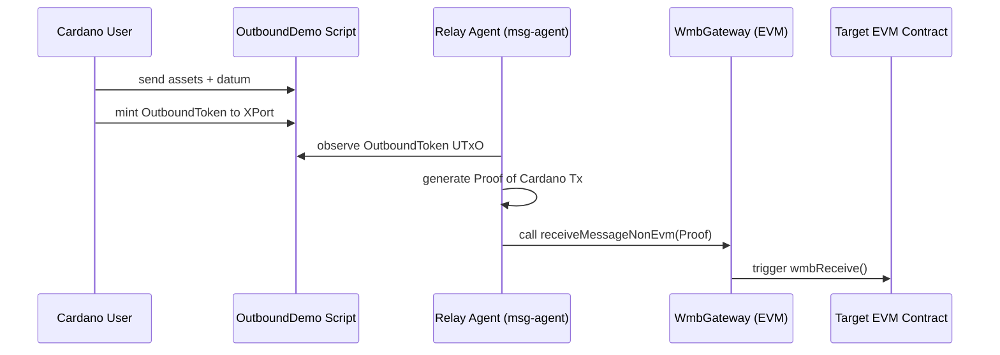

# Cardano-EVM XPort Bridge Runner

This repository contains an interactive CLI tool for running cross-chain message transactions between Cardano and EVM networks (specifically Wanchain) using the XPort protocol.

## Features

- **Directional Testing**: Choose between Cardano -> EVM and EVM -> Cardano directions.
- **Deterministic Wallets**: Derive both Cardano (BIP-1852) and EVM wallets from a single 24-word mnemonic.
- **Interactive Menu**: Easy-to-use menu for creating wallets, checking balances, distributing funds, and running transactions.
- **Case Management**: Test cases are organized by direction in CSV files.
- **Protocol Compliant**: Handles XPort-specific datum structures and transaction patterns.

## Project Structure

- `interactive_runner.py`: The main entry point for the interactive tool.
- `sendtransactions/`:
    - `cardano_msg.py`: Logic for Cardano -> EVM (Outbound) message transactions.
    - `evm_msg.py`: Logic for EVM -> Cardano (Inbound) message transactions.
- `utility/`:
    - `prepare_assets.py`: Wallet generation, balance checking, and fund distribution logic.
    - `interaction_utils.py`: Common CLI interaction helpers.
- `testcases/`:
    - `cardano_to_evm/`: CSV files containing test cases for Cardano to EVM.
    - `evm_to_cardano/`: CSV files containing test cases for EVM to Cardano.
- `config/`:
    - `rpc.json`: Configuration for network RPC URLs.
    - `contract_accounts.json`: Contract addresses and policy IDs.
    - `abis/`: ABI JSON files for EVM contracts.

## Module Interaction Flow



## XPort Workflows

### 1. From EVM to Cardano (Inbound)



1. **Initiation**: A user or DApp on EVM calls the `send()` function on the `TokenHome` contract (which interfaces with `WmbGateway`).
2. **Observation**: The `msg-agent` (Relay Agent) monitors the EVM chain for `MessageSent` events.
3. **Relay**: The agent collects MPC signatures and builds an Inbound transaction on Cardano.
4. **Execution**: The transaction mints an `InboundToken` and sends it to the target Cardano DApp script with a `CrossMsgData` datum.
5. **Consumption**: The Cardano DApp script validates the `InboundToken` and executes the intended logic (e.g., unlocking assets).

### 2. From Cardano to EVM (Outbound)



1. **Initiation**: A Cardano DApp script initiates a message by sending assets to the `OutboundDemo` script.
2. **Token Minting**: The transaction mints an `OutboundToken` and sends it to the `XPort` contract with a `CrossMsgData` datum.
3. **Observation**: The `msg-agent` monitors the Cardano `XPort` contract address for new UTxOs containing `OutboundTokens`.
4. **Proof Submission**: The agent generates a proof of the Cardano transaction and submits it to `WmbGateway.receiveMessageNonEvm()` on the EVM side.
5. **Execution**: `WmbGateway` verifies the proof and triggers the `wmbReceive()` function on the target EVM contract.

## Getting Started

### Prerequisites

- Python 3.10+
- A [Blockfrost](https://blockfrost.io/) API Key for Cardano access.

### Installation

1. Clone the repository.
2. Install dependencies:
   ```bash
   pip install -r requirements.txt
   ```

### Configuration

1. Create a `.env` file in the root directory and add your Blockfrost API key:
   ```env
   YOUR_BLOCKFROST_PROJECT_ID=your_project_id_here
   ```
2. Ensure `config/contract_accounts.json` contains the correct contract addresses for your target environment.

## Usage

1. Run the interactive runner:
   ```bash
   python interactive_runner.py
   ```
2. Select the Cardano network (Mainnet or Preprod).
3. Select the bridge direction.
4. Select a test case file from the listed options.
5. Use the menu to:
    - **Create Wallets**: Generates wallets from your mnemonic. Credentials are saved in `current_cardano_wallets.json` and `current_evm_wallets.json`.
    - **Check Balances**: Verifies native token balances for all generated wallets.
    - **Distribute Funds**: Sends ADA/WAN from the main wallet to batch wallets.
    - **Run Transactions**: Executes the cross-chain transactions based on the selected CSV.

## Test Case Format

Test cases are CSV files.

### Cardano -> EVM
Columns: `to_address`, `amount_raw`, `gas_limit`
- `to_address`: Target EVM address.
- `amount_raw`: Amount of tokens (in base units).

### EVM -> Cardano
Columns: `to_address`, `amount_raw`, `gas_limit`
- `to_address`: Target Cardano Bech32 address.
- `amount_raw`: Amount of tokens (in base units).
